# WEB SOLUTION WITH WORDPRESS

creating two redhat EC2 instances as web and database servers

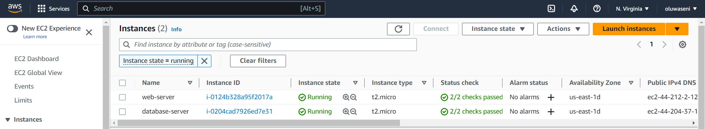

creating EBS volumes in the same availability zone as my EC2 instance "webserver" and attach it to instance

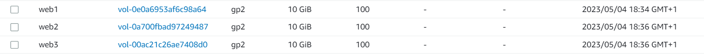

` lsblk`  inspecting what block devices are attached to the server. xvdf, xvdh, xvdg was seen

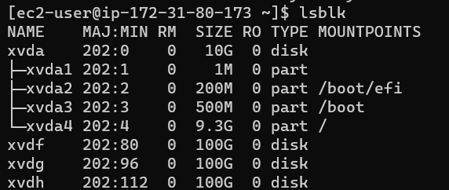

`ls /dev/` using ls /dev/ to check devices in the /dev/ directory

`df -h` checking all mounts and free space on your server

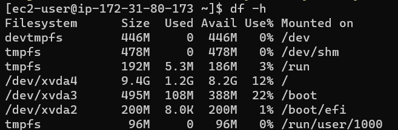

`sudo gdisk /dev/xvdf` using gdisk to create a single patition on xvdf

.png)

`sudo gdisk /dev/xvdg` using gdisk to create a single patition on xvdg

.png)

`sudo gdisk /dev/xvdh` using gdisk to create a single patition on xvdh

.png)

`lsblk` checking patitions created

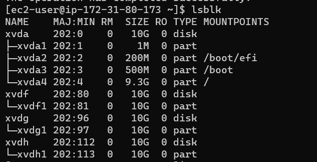

`sudo yum install lvm2` installing lvm2 package

`sudo lvmdiskscan`

`which lvm` to check if lvm has been installed and the path

`sudo pvcreate /dev/xvdf1 /dev/xvdg1 /dev/xvdh1` to create physical volume use pvcreate on the patitioned volume

`sudo pvs` to confirm volume created

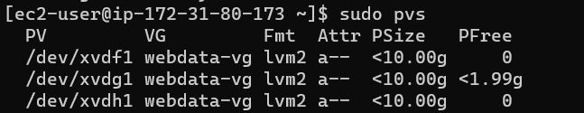

`sudo vgcreate webdata-vg /dev/xvdh1 /dev/xvdg1 /dev/xvdf1` to add all three disks into one and name it webdata-vg (volume group)

`sudo vgs` verification of combined disks

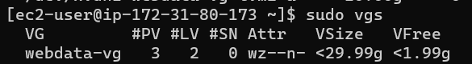

`sudo lvcreate -n apps-lv -L 14G webdata-vg` creating a 14 gigabyte logical volume in our physical volume called apps-lv to store data for the Website

`sudo lvcreate -n logs-lv -L 14G webdata-vg` creating a 14 gigabyte logical volume in our physical volume called logs-lv to store data for logs

`sudo lvs` Verifying that my Logical Volume has been created successfully

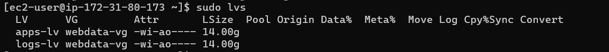

`sudo mkfs -t ext4 /dev/webdata-vg/apps-lv` adding a file system to our logical volume apps-lv

`sudo mkfs -t ext4 /dev/webdata-vg/logs-lv` adding a file system to our logical volume apps-lv

`sudo mkdir -p /var/www/html`

`sudo mkdir -p /home/recovery/logs`

`sudo mount /dev/webdata-vg/apps-lv /var/www/html/` to mount my logical volume on /var/www/html/

`df -h` to check mounted devices

`sudo rsync -av /var/log/. /home/recovery/logs/` copy document in /var/log/ to /home/recovery/logs/ as backup before mounting

`sudo mount /dev/webdata-vg/logs-lv /var/log` mounting logs-lv on /var/log

`sudo rsync -av /home/recovery/logs/. /var/log` restoring log files back into /var/log directory

`sudo blkid` to check and copy the block id of our devices app-lv and logs-lv

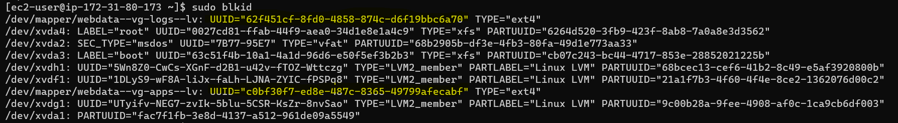

`sudo vi /etc/fstab` edit and paste block id's in  /etc/fstab

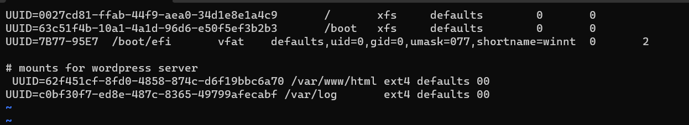

`sudo mount -a` to confirm if configuration in fstab is correct

`sudo systemctl daemon-reload`

Create three EBS volumes for the database server and attach to EC2 instance database server

`lsblk`

`sudo gdisk /dev/xvdf` creating partitions for xvdf

`sudo gdisk /dev/xvdg` creating partitions for xvdg

`sudo gdisk /dev/xvdh` creating partitions for xvdh

`lsblk`

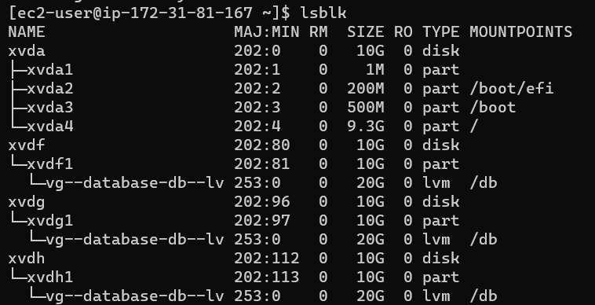

`sudo yum install lvm2 -y` run on database server

`sudo pvcreate /dev/xvdf1 /dev/xvdg1 /dev/xvdh1` run on database server

`sudo pvs` run on database server

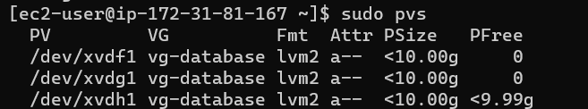

`sudo vgcreate vg-database /dev/xvdh1 /dev/xvdg1 /dev/xvdf1` run on database server

`sudo vgs` run on database server

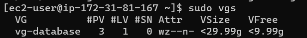

`sudo lvcreate -n db-lv -L 20G vg-database` run on database server

`sudo lvs` run on database server

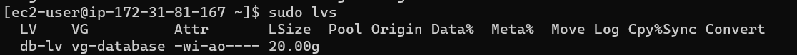

`sudo mkdir /db ` run on database server

`sudo mkfs.ext4 /dev/vg-database/db-lv` run on database server

`sudo mount /dev/vg-database/db-lv /db` run on database server

`df -h` run on database server

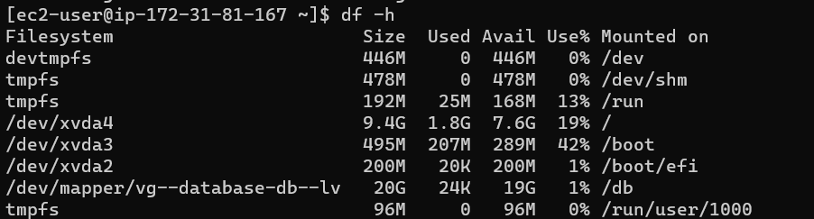

`sudo blkid` run on database server

`sudo vi /etc/fstab` run on database server

`sudo mount -a` run on database server

`sudo systemctl daemon-reload` run on database server

`df -h` run on database server

`sudo yum update -y` run update on both web and database servers

`sudo yum -y install wget httpd php php-mysqlnd php-fpm php-json` run on database server

`sudo yum install https://dl.fedoraproject.org/pub/epel/epel-release-latest-8.noarch.rpm` run on database server

`sudo yum install yum-utils http://rpms.remirepo.net/enterprise/remi-release-8.rpm` run on database server

`sudo yum module list php` run on database server

`sudo yum module reset php` run on database server

`sudo yum module enable php:remi-7.4` run on database server

`sudo yum install php php-opcache php-gd php-curl php-mysqlnd` run on database server

`php -v` run on database server

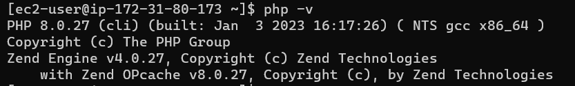

`sudo systemctl start php-fpm` run on database server

`sudo systemctl enable php-fpm` run on database server

`sudo systemctl status php-fpm` run on database server

`sudo setsebool -P httpd_execmem 1` run on database server

`sudo systemctl enable httpd` run on database server

`sudo systemctl start httpd` run on database server

`sudo systemctl status httpd` run on database server

`mkdir wordpress` run on database server

`cd  wordpress` run on database server

`sudo wget http://wordpress.org/latest.tar.gz` run on database server

`sudo tar xzvf latest.tar.gz` run on database server

`sudo rm -rf latest.tar.gz` run on database server

`cd wordpress` run on database server

`sudo cp wordpress/wp-config-sample.php wordpress/wp-config.php` run on database server

`cd ..` run on database server

`cp -R wordpress /var/www/html/` run on database server

`sudo chown -R apache:apache /var/www/html/wordpress` run on database server

`sudo chcon -t httpd_sys_rw_content_t /var/www/html/wordpress -R` run on database server

`sudo setsebool -P httpd_can_network_connect=1` run on database server

`cd /var/www/html` run on database server

`sudo yum update` run on database server

`sudo yum mysql-server` install mysql on the web server

`sudo yum install mysql-server` install mysql on database server also

`sudo systemctl start mysqld` start mysql on web server

`sudo systemctl enable mysqld` enable mysql on web server

`sudo systemctl status mysqld` check status of mysql service on web server

`sudo yum mysql-server` install mysql client on database server too, so it could talk to or connect with the web server

`sudo systemctl start mysqld` start mysql on database server

`sudo systemctl enable mysqld` enable mysqld on database server

`sudo systemctl status mysqld` check status of mysql on database server

`sudo mysql_secure_installation` (database server)

`sudo mysql -u root -p`(database server)

`mysql> create database wordpress;` (database server)

`mysql> show databases;` (database server)

`mysql> CREATE USER 'wordpress'@'%' IDENTIFIED WITH mysql_native_password BY 'wordpress';` (database server)

`mysql> GRANT ALL privileges ON *.* TO 'wordpress'@'%' WITH GRANT OPTION;` (database server)

`mysql> FLUSH PRIVILEGES;` (database server)

`mysql> select user, host from mysql.user;` (database server)

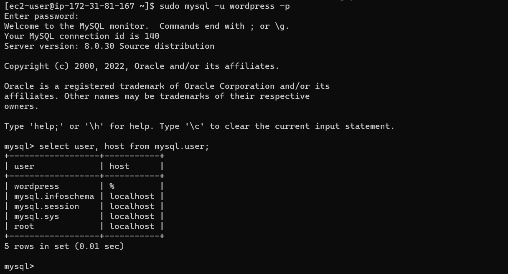

`mysql> exit`

`sudo vi /etc/my.cnf` setting the bind address of the databaser server to 0.0.0.0

`bind-address=0.0.0.0` to connect from anywhere

`sudo systemctl restart mysqld` restart mysql of the database server

`sudo systemctl enable mysqld` enable mysql of the database server

`sudo systemctl status mysqld` check status of mysql of the database server

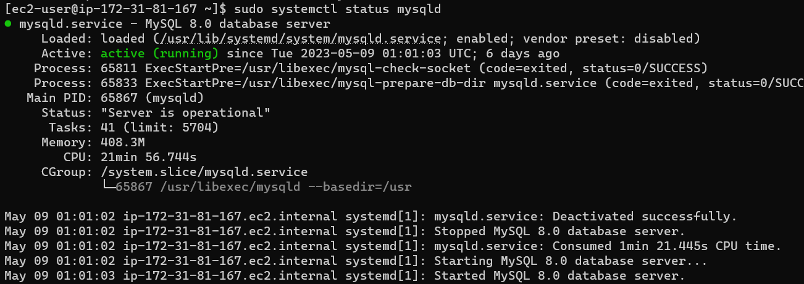

`sudo vi wp-config.php` on the web server, edit database name, database user, database password, and use the private ip of the database server as the database host

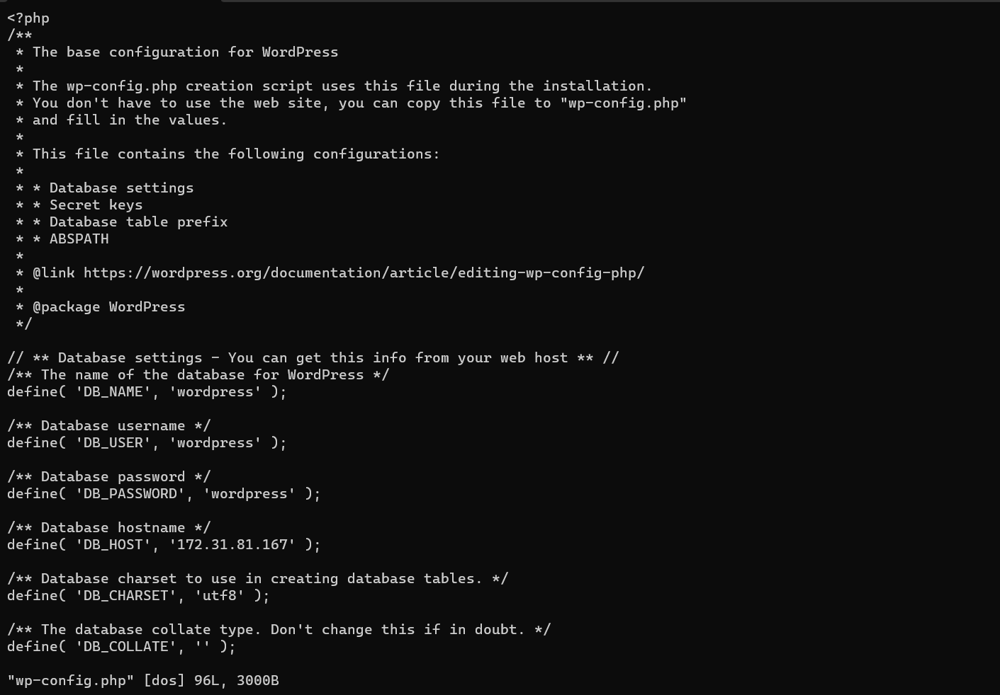

`sudo systemctl restart httpd` restart httpd on the web server

`sudo mv /etc/httpd/conf.d/welcome.conf /etc/httpd/conf.d/welcome.conf_backup` to disable the testpage of apache on browser on webserver

opening port 3306 inbound rule on my database server

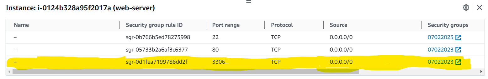

`sudo mysql -h 172.31.81.167 -u wordpress -p ` on webserver

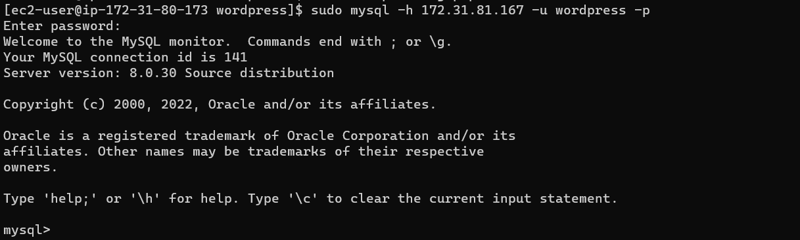

`mysql> SHOW DATABASES` on webserver

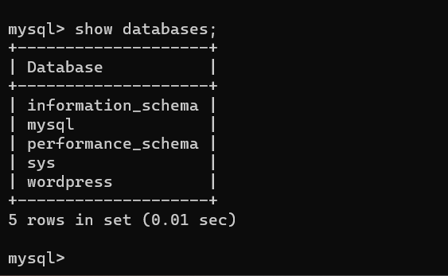

http://18.206.253.42/wordpress/

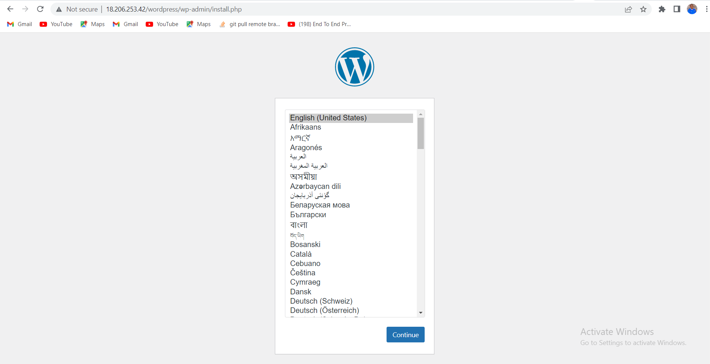

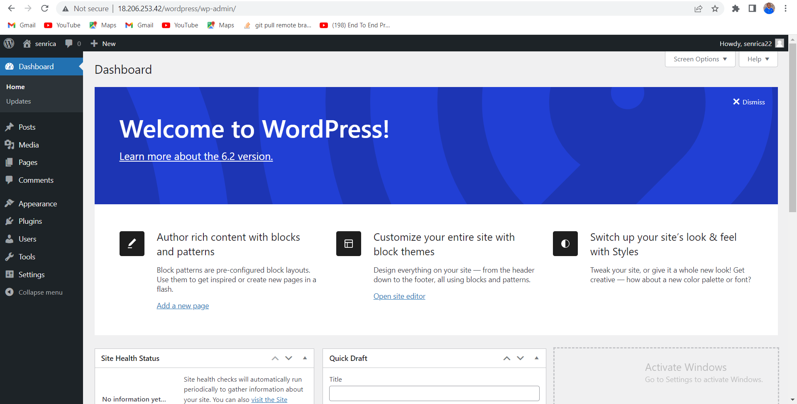
